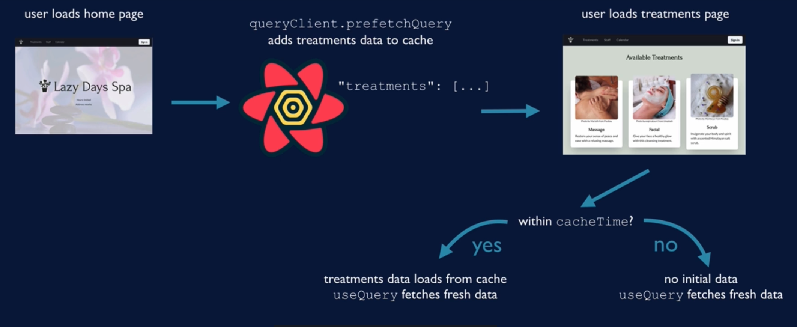

# Prefetch Concept

- prefetch with pagination
    - prefetch next page

- different trigger: prefetch treatments on **home page load**
    - user research: **85%** of home page loads are followed by treatments tab loads
    - Treatments don't change often, so cached data isn't really a problem

- Garbage collected if no `useQuery` is called after `cacheTime`

    - if typically not loaded by default `cacheTime`(5min), specify longer cacheTime

- `prefetchQuery` is a method on the `queryClient`
    - adding to the client cache
    - useQuery는 페칭(fetching)과 리페칭(Refetching) 등의 작업이 필요한 쿼리를 생성하지만 `prefetchQuery`는 **일회성**입니다

- `useQueryClient` returns `queryClient` (**within Provider**)

- Make a `usePrefetchTreatments` hook within `useTreatments.ts` (동일한 파일 내에 생성)

    - uses the same query function and key as the useTreatments call
    - call `usePrefetchTreatments` **from Home component**
    - (데이터가 캐시에 먼저 로드되고 cacheTime이 지나기 전에 사용자가 Treatments 페이지로 이동하는 한 캐시된 데이터를 표출할 수 있기 때문에 사용자는 서버 호출을 할 때까지 기다릴 필요가 없습니다. -> 사용자경험 상승)

